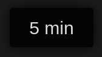

# Thunderbird Reading Time

A simple Thunderbird extension that adds a pop-up to e-mails with the estimated reading time, based on 200 words per minute (configurable in the addon options). Highly inspired by the Reading Time Firefox add-on (https://github.com/scripts-richard/reading_time).

  

## Installation

<!-- [Visit the Firefox add-ons page in your browser.](https://addons.mozilla.org/en-US/firefox/addon/reading-time/) -->

TBD.

## Contributing

1. Fork it!
2. Create your feature branch: `git checkout -b my-new-feature`
3. Commit your changes: `git commit -am 'Add some feature'`
4. Push to the branch: `git push origin my-new-feature`
5. Submit a pull request!

## License

MIT License